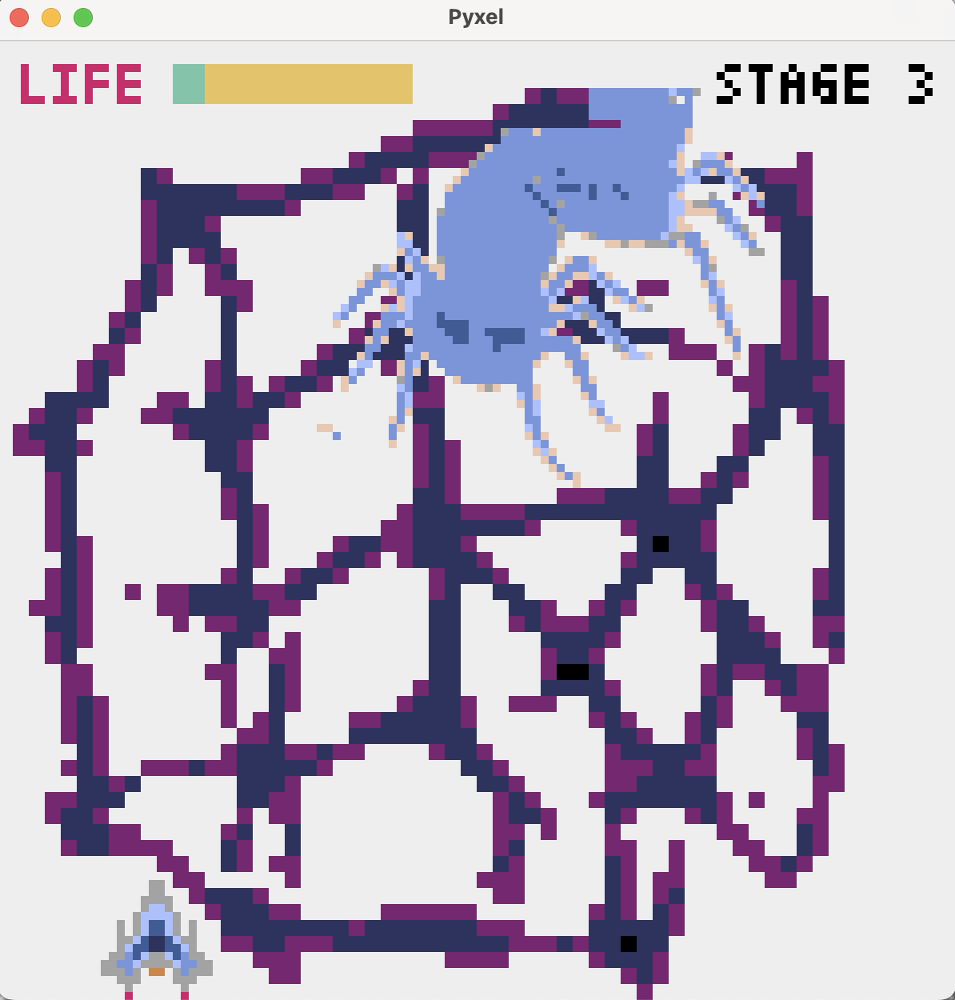

# nca_game

Introducing a new invader game: your mission is to obliterate Neural Cellular Automata! These enemies don’t have life bars—they’re trained to regenerate back to their original forms. What does 'life' really mean in this game?

created by Takahide Yoshida and Hiroki Sato 

# Requirements
- pyxel 
- onnxruntime 
- numpy 

# Getting Started

## install Pyxel
see https://github.com/kitao/pyxel/blob/main/docs/README.ja.md

## How to play
Simply execute the `main.py` file from your terminal: